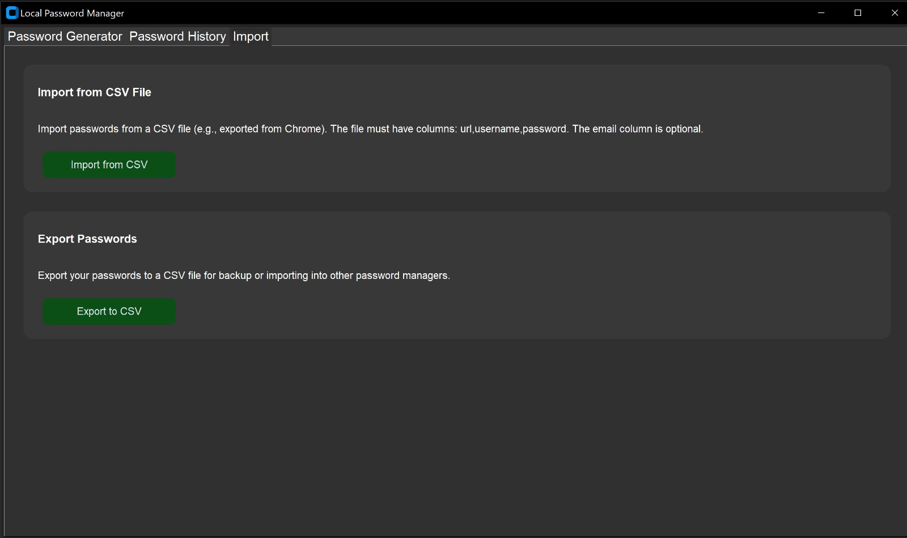

# MPass - Local Password Manager

A secure, offline password manager built with Python and CustomTkinter, designed to store and manage passwords locally on your machine. It features a modern dark-themed UI inspired by PHP Switcher, strong encryption, and a configurable interface. The application auto-exits after a user-defined inactivity period to enhance security.




## Features

- **Password Generation**: Create strong, customizable passwords with options for length, character types (lowercase, uppercase, digits, special), and exclusion of similar characters.
- **Password Storage**: Store passwords locally in an encrypted file (`passwords.encrypted`) with Fernet (AES-128) encryption.
- **CSV Import/Export**: Import passwords from CSV files (e.g., Chrome exports) and export your vault for backups or other managers.
- **Search and Filter**: Search passwords by website, username, or email, and filter by creation date (today, last week, last month).
- **Modern UI**: Dark theme with PHP Switcher-inspired colors (`#383838`, `#303030`, `#0b4f16`), customizable via `config.json`.
- **Inactivity Timeout**: Automatically exits after a configurable period (default: 5 minutes) of no mouse/keyboard activity.
- **Secure Key Derivation**: Uses PBKDF2HMAC (SHA256, 100,000 iterations) with a random salt stored in `.env`.
- **Cross-Platform**: Runs on Windows, Linux, and macOS with Python 3.12.

## Prerequisites

- **Python 3.12**: Required to run the application.
- **Dependencies**:
  - `customtkinter==5.2.2`: Modern Tkinter widgets for the UI.
  - `pyperclip==1.9.0`: Clipboard functionality.
  - `cryptography==43.0.1`: Encryption and key derivation.
  - `python-dotenv==1.0.1`: Environment variable management.

## Installation

1. **Clone the Repository**:

   ```bash
   git clone git@github.com:yourusername/password-manager.git
   cd password-manager
   ```

2. **Install Python 3.12**:

   - Download and install Python 3.12 from python.org.
   - Verify:

     ```bash
     python3 --version
     ```

     Should output `Python 3.12.x`.

3. **Install Dependencies**:

   ```bash
   pip install -r requirements.txt
   ```

   This installs `customtkinter`, `pyperclip`, `cryptography`, and `python-dotenv`.

## Usage

1. **Run the Application**:

   ```bash
   python3 password_manager.py
   ```

2. **Set Up Master Password**:

   - On first run, create a master password. This generates a random salt in `.env` and an encrypted vault (`passwords.encrypted`).
   - On subsequent runs, enter your master password to unlock the vault.

3. **Key Features**:

   - **Generate Passwords**: Use the "Password Generator" tab to create passwords, copy them, and save with website/username/email details.
   - **View History**: In the "Password History" tab, search, filter, copy, edit, or delete entries. Toggle password visibility with the "Show/Hide" button.
   - **Import/Export**: Use the "Import" tab to import from CSV (requires `url`, `username`, `password` columns) or export your vault to CSV.
   - **Inactivity Timeout**: The app exits after the configured inactivity period (default: 5 minutes, or 60 seconds in provided `config.json`).

4. **Customize Configuration**:

   - Edit `config.json` to tweak UI colors, font size, inactivity timeout, and password generation settings (see Configuration).

## Configuration

The application is customizable via `config.json`. If missing or invalid, defaults are used. Example:

```json
{
  "bg_fore": "#383838",
  "bg_back": "#303030",
  "white_fore": "white",
  "colorEdit": "#0b4f16",
  "colorEditHover": "#07330e",
  "fontSize": 30,
  "inactivityLimit": 60,
  "passwordLength": 16,
  "includeLowercase": true,
  "includeUppercase": true,
  "includeDigits": true,
  "includeSpecial": true,
  "excludeSimilar": false,
  "filterOption": "All",
  "searchField": "All Fields",
  "showPasswords": false
}
```

### Config Options

- **bg_fore**: Background color for UI elements (hex, e.g., `#383838`).
- **bg_back**: Window background color (hex, e.g., `#303030`).
- **white_fore**: Text color (hex or `"white"`).
- **colorEdit**: Button color (hex, e.g., `#0b4f16`).
- **colorEditHover**: Button hover color (hex, e.g., `#07330e`).
- **fontSize**: Font size for UI (integer ≥ 10, default: 30).
- **inactivityLimit**: Seconds of inactivity before auto-exit (integer ≥ 30, default: 300).
- **passwordLength**: Default password length (integer ≥ 8, default: 16).
- **includeLowercase**, **includeUppercase**, **includeDigits**, **includeSpecial**: Include character types in password generation (boolean, default: true).
- **excludeSimilar**: Exclude similar characters (e.g., `l1IoO0`) in password generation (boolean, default: false).
- **filterOption**: Default history filter ("All", "Today", "Last Week", "Last Month"; default: "All").
- **searchField**: Default search field ("All Fields", "Website/App", "Username", "Email"; default: "All Fields").
- **showPasswords**: Show passwords in history by default (boolean, default: false).

### Validation

- Colors must be valid hex (`#RRGGBB`) or `"white"` for `white_fore`.
- `fontSize` must be ≥ 10 for readability.
- `inactivityLimit` must be ≥ 30 seconds for usability.
- `passwordLength` must be ≥ 8 for security.
- Invalid or unknown keys trigger console warnings and fallback to defaults.

To test customization:

1. Edit `config.json` (e.g., change `bg_fore` to `#4a4a4a`, `inactivityLimit` to 120).
2. Run `python3 password_manager.py` and verify changes.
3. Delete `config.json` to test defaults.

## Security

- **Encryption**: Passwords are stored in `passwords.encrypted` using Fernet (AES-128).
- **Key Derivation**: Master password is processed with PBKDF2HMAC (SHA256, 100,000 iterations) and a random salt in `.env`.
- **Inactivity Timeout**: Auto-exits after configurable inactivity (default: 5 minutes) to prevent unauthorized access.
- **Sensitive Files**: `.env`, `passwords.encrypted`, `config.json`, and `*.csv` are excluded from Git via `.gitignore`.

**Note**: Keep your master password secure and back up `passwords.encrypted` and `.env`. Losing them prevents vault access.

## Troubleshooting

1. **Application Fails to Run**:

   - **Error**: `python3: command not found` or wrong Python version.
   - **Fix**:

     ```bash
     python3 --version
     ```

     Install Python 3.12 and ensure it’s in PATH.
   - **Error**: Missing dependencies.
   - **Fix**:

     ```bash
     pip install -r requirements.txt
     ```

2. **Config Issues**:

   - **Error**: UI doesn’t reflect `config.json`.
   - **Fix**: Check console for warnings (e.g., `Invalid hex color`). Ensure valid JSON:

     ```bash
     python3 -m json.tool config.json
     ```
   - Delete `config.json` to use defaults.

3. **Inactivity Timeout Incorrect**:

   - **Fix**: Verify `inactivityLimit` in `config.json` (≥ 30). Test by idling.

4. **Sensitive Files in Git**:

   - **Fix**: Verify `.gitignore` includes:

     ```
     .env
     passwords.encrypted
     config.json
     *.csv
     ```

     Remove:

     ```bash
     git rm --cached .env passwords.encrypted config.json
     ```

## Contributing

Contributions are welcome! To contribute:

1. Fork the repository.
2. Create a branch (`git checkout -b feature/your-feature`).
3. Commit changes (`git commit -m "Add your feature"`).
4. Push to branch (`git push origin feature/your-feature`).
5. Open a Pull Request.

Please include tests and update documentation for new features.

## License

This project is licensed under the MIT License. See LICENSE for details.

---

Built with 💻 by Maged Safwat. Star the repo if you find it useful! 🌟
